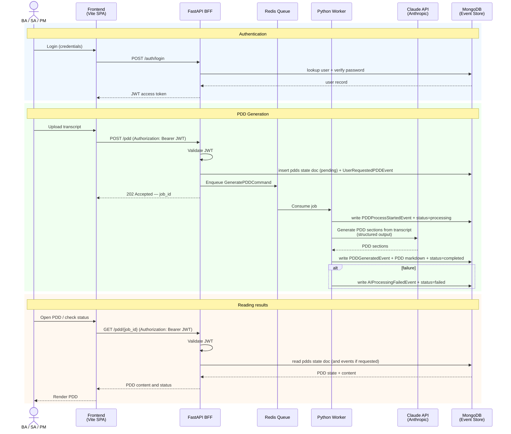

# System Architecture

## Overview

PDD Creator converts RPA process transcripts into structured Process Design Documents (PDD).
The system is built on an asynchronous, event-driven architecture with hexagonal design per module.

The stack is cloud-agnostic: every component runs as a regular process or Docker container, and
the deployment target is deliberately not decided yet (see [infra conventions](infra/conventions.md)).

**Core stack decisions:**

| Concern | Choice |
|---------|--------|
| AI provider | Claude API (Anthropic) via the official `anthropic` Python SDK — default model `claude-opus-4-8` |
| Message queue | Redis — the API enqueues jobs, the worker consumes them |
| Persistence | MongoDB (Event Store + state documents — see [database.md](database.md)) |
| Observability | Structured logging to stdout; log aggregation decided with the deployment target |

## Request Flow

## Module Boundaries

| Module | Responsibility | Runtime |
|--------|---------------|---------|
| `frontend/` | Vite SPA — user interface | Static hosting (target TBD) |
| `api/` | FastAPI BFF — auth, job submission, PDD reads | Docker container |
| `worker/` | Python worker — consumes the Redis queue, calls the Claude API, persists events and artifacts | Docker container |

## Rules for implementers

- `api/` does NOT call the Claude API directly — generation is triggered via the Redis queue
- `api/` READS from MongoDB — it serves PDD state and content to the frontend
- `worker/` does NOT expose HTTP endpoints — triggered exclusively by the queue
- `worker/` is the only module that calls the Claude API, through the official `anthropic` SDK (never raw HTTP). The model is configuration (`settings`), defaulting to `claude-opus-4-8`
- `frontend/` does NOT call `worker/` directly — all traffic goes through `api/`
- Each module follows hexagonal architecture: `domain/` → `use_cases/` → `infrastructure/` ← `delivery/`
- Events in MongoDB are immutable — never update, only append. State documents (`pdds`) are the mutable projection
