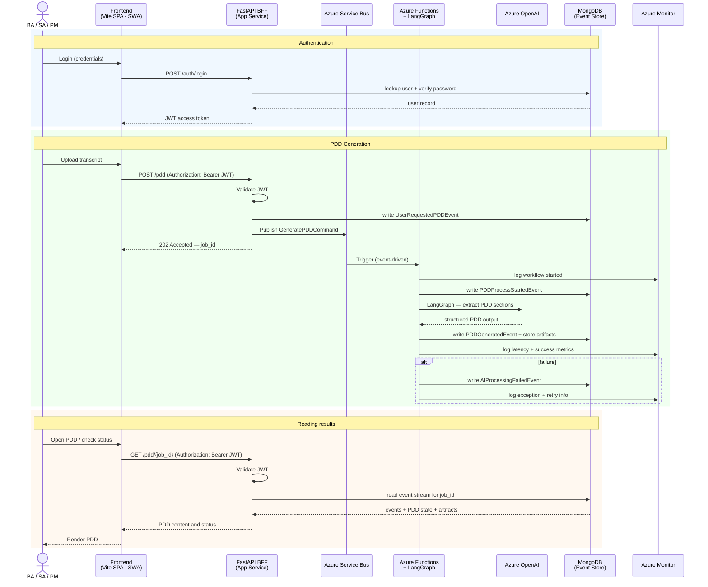

# System Architecture

## Overview

PDD Creator converts RPA process transcripts into structured Process Design Documents (PDD).
The system is built on an asynchronous, event-driven architecture with hexagonal design per module.

## Request Flow

## Module Boundaries

| Module | Responsibility | Deployable |
|--------|---------------|------------|
| `frontend/` | Vite SPA — user interface | Azure Static Web Apps |
| `api/` | FastAPI BFF — auth, job submission, PDD reads | Azure App Service |
| `worker/` | Azure Functions + LangGraph — job processing, AI calls, event persistence | Azure Functions |

## Rules for implementers

- `api/` does NOT call OpenAI directly — generation is triggered via Service Bus
- `api/` READS from MongoDB — it serves PDD state and content to the frontend
- `worker/` does NOT expose HTTP endpoints — triggered exclusively by Service Bus
- `frontend/` does NOT call `worker/` directly — all traffic goes through `api/`
- Each module follows hexagonal architecture: `domain/` → `use_cases/` → `infrastructure/` ← `delivery/`
- Events in MongoDB are immutable — never update, only append
